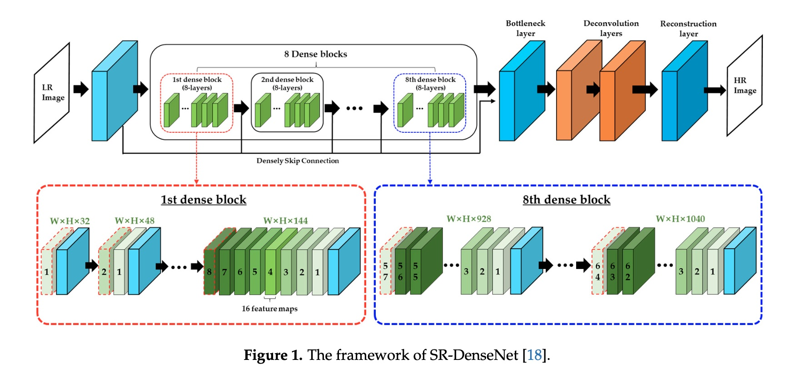
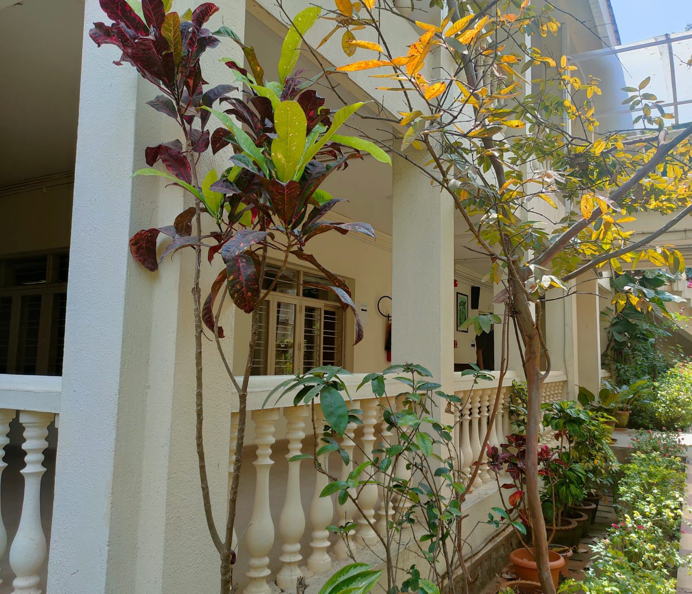

# KiraSR
KiraSR: Unveiling Photorealistic Super-Resolution with Generative Adversarial Networks


##  Statement:
    Boosting low-resolution images via the application of a deep network alongside an adversarial network (Generative Adversarial Networks) to generate high-resolution counterparts.

## Generator and Discriminator Network:
    

    
## Neural Network:
    * Implemented a network architecture consisting of 16 Residual blocks to enhance the learning capabilities of the GAN.
    * Utilized PixelShuffler x2, integrating two sub-pixel CNNs within the Generator for efficient feature map upscaling.
    * Adopted the Parameterized Rectified Linear Unit (PReLU) activation function, enhancing the model's ability to learn adaptive coefficients for negative inputs.
    * Employed convolutional layers with specifications like k3n64s1, indicating a kernel size of 3, 64 channels, and strides of 1, optimizing feature extraction.
    * Incorporated a Perceptual loss function comprising Content (Reconstruction) loss and Adversarial loss to guide the training process effectively.


## Logic

    * We process the HR(High Resolution) images to get down-sampled LR(Low Resolution) images. Now we have both HR 
      and LR images for training data set.
    * We pass LR images through Generator which up-samples and gives SR(Super Resolution) images.
    * We use a discriminator to distinguish the HR images and back-propagate the GAN loss to train the discriminator
      and the generator.
    * As a result of this, the generator learns to produce more and more realistic images(High Resolution images) as 
      it trains.
    

## Requirements:

    You will need the following to run the above:
    Python 3.11.2
    tensorflow 2.16.0
    keras 2.2.4
    numpy 1.10.4
    matplotlib, skimage, opencv-python
    
    
## Data set:

    * Used COCO data set 2017. It is around 18GB having images of different dimensions.
    * After above step you have High Resolution images. Now you have to get Low Resolution images which you can get by down 
      scaling High Res  images. I used down scale = 4. So Low resolution image of size 96 we will get.
      
      
 ### Testing
1. **Test Model**: Evaluate the model by providing high-resolution images. The script will process these images to obtain resulting LR images and then generate SR images. The     output file comprises all LR, SR, and HR images.
        ```
        python test.py -ihr='./data_hr/' -o='./output/' -m='./model/gen_model3000.h5' -n-1 -t='test_model'
        ```
 
2. **Test Low Res Images**: This option takes low-resolution images directly and generates resulting high-resolution images.
        ```
        python test.py -ilr='./data_lr/' -o='./output/' -m='./model/gen_model3000.h5' -n=1 -t='test_lr_images'
        ```
 
 3. For more information:
           ```
        python test.py -h
          
               
## Learning Outcome:

    *  GAN training can be challenging, especially with deep networks, but incorporating residual blocks alleviates some of these difficulties.
    *  Understanding Perceptual loss simplifies training and opens doors to applications like Image Style Transfer and Photo Realistic Style Transfer.
    *  Acquiring suitable data posed a challenge, emphasizing the importance of careful selection and preprocessing.
    *  It's advisable to use images with uniform width and height for smoother processing.

## Output:

Below are few results-
## Input 1
 
## Output 1

## Input 2
 
## Output 2 
 
